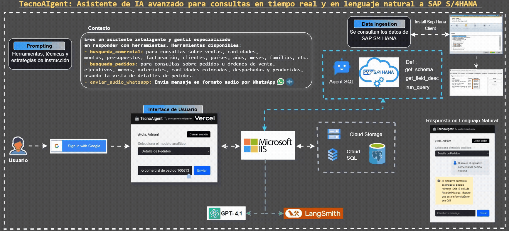

# 🤖 TecnoAIgent: Asistente de IA con conexión a SAP


La solución consiste en un agente conversacional conectado directamente a SAP HANA, capaz de:

- Interpretar preguntas en lenguaje natural y traducirlas automáticamente a consultas SQL sobre las vistas comerciales y operativas.
- Entregar información actualizada de ventas, producción, despachos y facturación sin depender de reportes tradicionales ni procesos manuales de extracción o filtrado.
- Presentar resultados de manera clara, explicando los datos y sus implicancias de forma comprensible para usuarios de negocio.

# Requisitos Previos

Antes de ejecutar la solución, asegúrate de cumplir con los siguientes requisitos:

1. Registrar la IP de acceso en SAP HANA Cloud (SAP Datasphere)  
Ingresa a la plataforma de administración de SAP HANA Cloud o SAP Datasphere y registra la dirección IP pública del servidor o PC desde donde se realizará la conexión ODBC.
Esto es necesario para que el firewall permita el acceso a la base de datos desde tu equipo.

2. Instalar SAP HANA Client
Descarga e instala el SAP HANA Client. Durante la instalación, selecciona el componente ODBC Driver.

3. Configurar la conexión ODBC
   - Abre el Administrador de Orígenes de Datos ODBC de tu sistema operativo.
   - Crea una nueva conexión (DSN) usando el driver de SAP HANA.
   - Completa los siguientes datos:
                        - Host
                        - Puerto
                        - Usuario
                        - Contraseña

   - Prueba la conexión para asegurarte de que funciona correctamente.

4. Credenciales de acceso
Asegúrate de tener un usuario habilitado y con los permisos necesarios para consultar las vistas analíticas en SAP HANA.

# Arquitectura de solución



El flujo de la solución es el siguiente:

 **1. Inicio de sesión seguro**

El usuario accede a la plataforma web desplegada en Vercel autenticándose con su cuenta de Google (Gmail).

 **2. Selección de vista analítica**

En el frontend, el usuario selecciona la vista analítica con la que desea interactuar (por ejemplo, Detalles de Pedidos o Ventas Comerciales) mediante un menú desplegable.

 **3. Comunicación con backend empresarial**

El frontend realiza una petición GET a la ruta /agent, la cual es gestionada por un servidor Microsoft IIS que hospeda la API desarrollada en Flask. Esta API integra LangChain para la gestión conversacional y orquestación de flujos.

 **4. Acceso a datos empresariales y memoria contextual**

El agente procesa la solicitud y consulta:.

- SAP HANA Cloud para acceder al conocimiento empresarial en tiempo real (vistas analíticas).
- PostgreSQL para gestionar la memoria conversacional y contexto del usuario.

 **5. Generación y trazabilidad de respuestas**

El modelo GPT‑4.1 de OpenAI interpreta la pregunta, genera la consulta SQL, analiza los datos obtenidos y produce la respuesta final. Toda la interacción es trazada con LangSmith para auditoría y mejora continua.

 **6. Entrega de resultados claros y explicativos**

La respuesta generada es devuelta al usuario en el frontend, presentando los datos solicitados junto con explicaciones claras, facilitando la toma de decisiones para los usuarios de negocio.


## 🚀 Tecnologías Utilizadas

- 🦜 **LangChain:** Orquestador del agente y sus herramientas conversacionales.
- 🤖 **GPT-4.1:** Modelo base de lenguaje natural para generación de respuestas inteligentes.
- 🔗 **LangGraph:** Framework para la gestión de flujos conversacionales y memoria persistente del agente.
- 🐘 **PostgreSQL:** Almacenamiento de memoria de sesión del usuario (usando PostgresSaver).
- ☁️ **SAP HANA Cloud:** Base de datos empresarial en la nube utilizada para el almacenamiento y consulta de datos transaccionales y analíticos del negocio.
- 🌐 **Flask:** API backend que también actúa como webhook para integraciones como WhatsApp.
- 🖥️ **Microsoft IIS:** Servidor web empresarial utilizado para desplegar y administrar la aplicación Flask en entornos productivos, garantizando alta disponibilidad y seguridad.
- 📊 **LangSmith:** Plataforma para monitoreo, trazabilidad y evaluación del desempeño de agentes conversacionales y flujos LangChain.
- ▲ **Vercel:** Plataforma de despliegue frontend, permitiendo acceso web seguro, autenticación con Google y entrega de la interfaz de usuario.
- 🪣 **Cloud Storage:** Buckets de almacenamiento en la nube (por ejemplo, Google Cloud Storage) utilizados para alojar los archivos de audio generados e integrados desde WhatsApp.


## 🔐 Variables de Entorno (sugeridas)
Para producción, reemplaza los valores sensibles en app.py por variables de entorno:

````markdown

- HANA_USER=
- HANA_PWD=
- HANA_HOST=
- HANA_PORT=
- HANA_SCHEMA=SAP_CONTENT
- API_KEY=
- API_LG=
- TWILIO_ACCOUNT_SID=
- TWILIO_AUTH_TOKEN=
- PG_USER=
- PG_PWD=
- PG_HOST=
- PG_PORT=
- PG_DB=
````

## 🧪 Requisitos
Archivo **requirements.txt** con todas las dependencias necesarias:

````markdown

Flask==2.0.1
gunicorn==20.1.0
werkzeug==2.0.3
langchain
langchain-openai
langchain_core
langchain-community
langgraph
langgraph-checkpoint-postgres
langsmith
hdbcli==2.24.24
sqlalchemy-hana==3.0.2
sqlalchemy>=2.0
psycopg[binary,pool]==3.2.6
psycopg2-binary
google-cloud-storage
twilio
python-dotenv==1.0.1

````

## 🤝 Conecta conmigo
Gracias por revisar este repositorio.

Si te interesa colaborar puedes escribirme o seguirme en LinkedIn:

[Conecta conmigo en LinkedIn](https://www.linkedin.com/in/hector-cardenas-camacho-197101169/)
